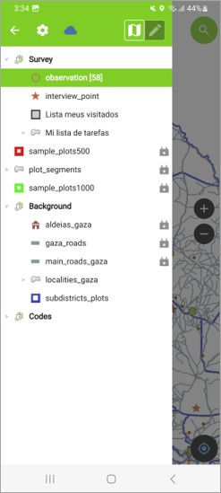
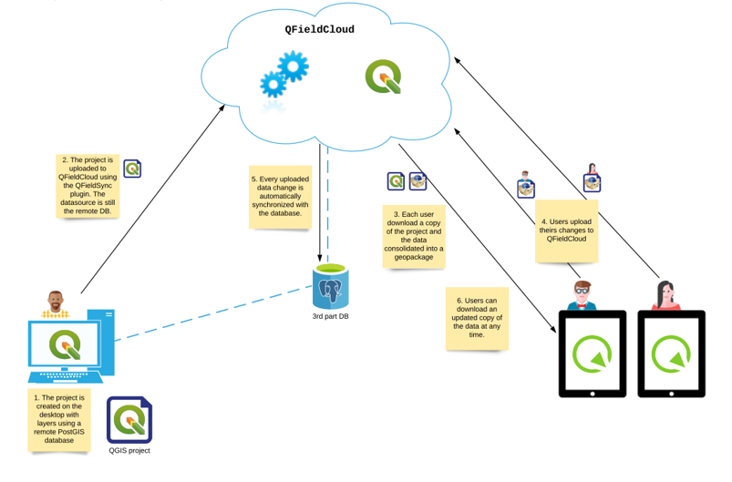

Architecture
============

.. _architecture:

The mobile app is the primary instrument for the data collection.
In order to enable such an app, back-end components were installed and configured.

Database server
---------------

The spatial data is managed via PostgreSQL under Linux Ubuntu.
The Database server contains both, reference data and the survey layers to be populated by the enumerators during the fieldwork. 

1. Survey layers:

	Two spatial layers namely *observation* and *interview_point*. 
	- *observation* is utilized to add observation points (land cover/ crops) in the field
	- *interview_point* is utilized to collect expert information from *extension agents*.
	
	To aid in the data collection: two supporting layers were added: 
	
	- *Lista meus visitados* keeps record of the plots that were visited.
	- *Mi lista de tarefas* contains the EU units assigned to
	an enumerator and it is the starting point of the data collection workflow.

2.  Sample Frame:

	- Enumeration units: Areas of 500x500 meters.
	- Enumeration units: Areas of 1x1 Kilometers. A buffer (250m ) around the enumeration unit of 500mx500m.
	- Plot_segments: The EU were preliminary delineated and classified (land cover) using high resolution satellite images.
	Such classification served as input for the data collection.

3. Reference data:

	To support enumerators work on the field, several geospatial layers were included in the app.
	- Aldeais GAZA: villages or small towns in GAZA province
	- Gaza roads: roads at secondary and tertiary level in the province
	- Main gaza roads: primary roads in the province
	- Localities: localities in the study area
	- Subdistricts: Subdistricts in the study area
	All the reference data was provided by the local team in Gaza.

4. Code list

	The app minimize the input data via predefined code lists, for example for *irrigation type*, or *land cover class*.
	also a list of *crops* categorized in groups is available. More details can be found in the data model.

The image below shows the geospatial data included in the app.

Qfield cloud
------------

A local instance of Qfield cloud was launched and configured in a Linux Ubuntu server.
This instance provides all the necessary functionality to enable enumerator to use the mobile data collection app
and synchronize the collected data to the DB server.

Documentation of *Qfield cloud* installation is available at: 

`Qfield cloud - Github repository <https://github.com/opengisch/qfieldcloud/>`_

The complete architecture and workflow for data synchronization is illustrated in the image below.

