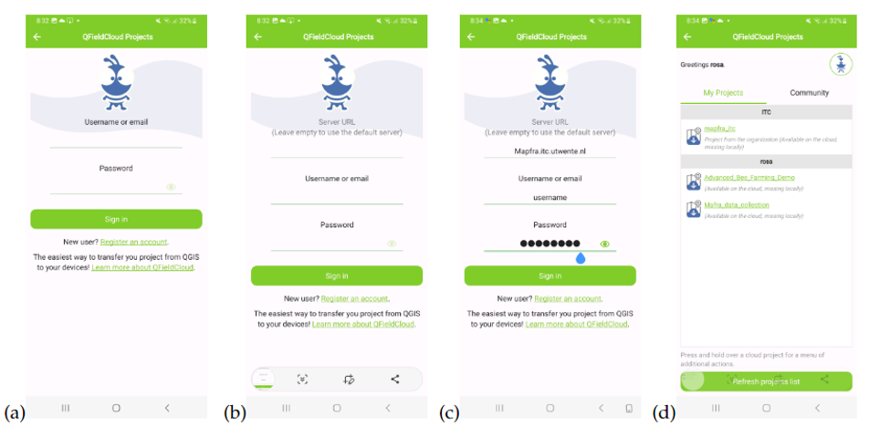

Usage
=====

.. _installation:

Installation
------------

To use the mobile app, first install **Qfield**.
Installation of the *QField* app is really straightforward. For Android
phones, one uses the Google PlayStore to find and install it, 
[search qfield](https://play.google.com/store/search?q=Qfield&c=apps&pli=1)

For an iOS phone, the Apple AppStore provides the same [search qfield ios](https://apps.apple.com/us/app/qfieldfor-qgis/id1531726814)

Signing-in
----------

You first need to authenticate in order to use the app.
You will be provided with an user and password and the URL of the platform.
See the image below

The steps are as follows:

a) Open QfieldCloud projects
 
b) Double click in the .. image:: images/bee-icon.png

c) Configure the server URL mapfra.itc.utwente.nl and type your username and password. Click on sign in.

d) After successfully signing in, you will see the project list
